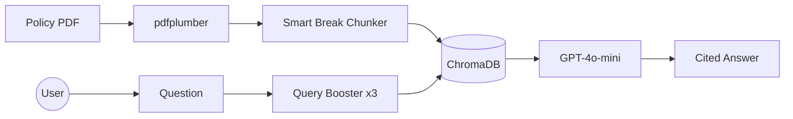

# Manulife Travel Insurance AI Assistant 


A Retrieval-Augmented Generation (RAG) system that answers questions about Manulife Travel Insurance plans by extracting and reasoning over dense comparison tables from a PDF policy document.

---


## The Problem

Insurance comparison tables are notoriously difficult for standard AI tools to reason over. This document contains 7+ plans across multiple pages with multi-line table cells, age-based eligibility rules, and geographic exclusions. Standard character-based chunking destroys the column structure that makes these tables meaningful.

---

## How It Works

### 1. PDF Ingestion (`ingestion.py`)

Uses `pdfplumber` instead of general-purpose PDF libraries because it reads actual table cell boundaries rather than flattening text linearly. This correctly preserves multi-line cells like:

```
Trip duration | Age 0-59: 365 days
              | Age 60-74: 60 days
              | Age 75+: 45 days
```

Each page produces two outputs:

- **Raw prose text** — for semantic retrieval
- **Markdown table** — for column-aware answer generation

Both are combined and passed to the chunker.

### 2. Smart Break Chunker (`ingestion.py`)

Instead of cutting at a fixed character count, the chunker looks backwards from the cut point to find the nearest newline using `rfind('\n')`. This ensures table rows are never split mid-row.

A minimum chunk size guard prevents creating tiny unusable chunks on short pages.

### 3. Vector Store (ChromaDB + `text-embedding-3-small`)

Chunks are embedded using OpenAI's `text-embedding-3-small` and stored in ChromaDB for semantic retrieval.

### 4. Query Expansion (`assistant.py`)

A single query often misses relevant chunks spread across multiple pages. Three booster queries are run per question and results are deduplicated:

```python
booster_queries = [
    question,
    f"plan coverage limit {question}",
    f"table data {question}"
]
```

### 5. Answer Generation (GPT-4o-mini)

Retrieved chunks are passed to GPT-4o-mini with a system prompt that explicitly defines column order for each table type — preventing the model from misattributing values to the wrong plan.

### 6. Evaluation (`evaluator.py`)

An offline LLM-as-judge evaluator benchmarks the system against a 4-tier test suite.

---

## Architecture



---

## Evaluation Results

Tested against a 4-tier benchmark using LLM-as-judge:

| Test   | Question                                                    | Result                |
| ------ | ----------------------------------------------------------- | --------------------- |
| Easy   | What is the emergency dental limit for TravelEase?          | ✅ PASS               |
| Medium | Which all-inclusive plan can a 77 year old buy for 45 days? | ✅ PASS               |
| Hard   | Which plans cover hospital allowance?                       | ❌ FAIL (judge error) |
| Trap   | How do I file a claim?                                      | ✅ PASS               |

**Score: 75% (3/4)**

The Hard test failure is a judge limitation, not a RAG failure — the actual answer was manually verified as correct against the source PDF. LLM-as-judge is imperfect and this is a known limitation of the evaluation approach.

---

## Known Limitations

- Tables embedded as images in PDFs cannot be extracted — pdfplumber requires selectable text
- Answers are limited to the Manulife comparison chart document only
- LLM-as-judge evaluation can produce incorrect verdicts on complex multi-part questions

---

## Tech Stack

| Component    | Technology                    |
| ------------ | ----------------------------- |
| PDF Parsing  | pdfplumber                    |
| Embeddings   | OpenAI text-embedding-3-small |
| Vector Store | ChromaDB                      |
| LLM          | OpenAI GPT-4o-mini            |
| Frontend     | Streamlit                     |
| Language     | Python 3.11                   |

---

## Setup

**1. Clone and install dependencies:**

```bash
git clone https://github.com/mittalchande/insurance-rag-assistant.git
cd insurance-rag-assistant
pip install -r requirements.txt
```

**2. Create a `.env` file:**

```
OPENAI_API_KEY=your_key_here
```

**3. Run ingestion to process the PDF:**

```bash
python ingestion.py
```

**4. Start the assistant:**

```bash
streamlit run app.py
```

**5. Run the evaluation benchmark:**

```bash
python evaluator.py
```

---

## Source Document

[Manulife Travel Insurance Comparison Charts](# Manulife Travel Insurance AI Assistant

A Retrieval-Augmented Generation (RAG) system that answers questions about Manulife Travel Insurance plans by extracting and reasoning over dense comparison tables from a PDF policy document.

---

## The Problem

Insurance comparison tables are notoriously difficult for standard AI tools to reason over. This document contains 7+ plans across multiple pages with multi-line table cells, age-based eligibility rules, and geographic exclusions. Standard character-based chunking destroys the column structure that makes these tables meaningful.

---

## How It Works

### 1. PDF Ingestion (`ingestion.py`)

Uses `pdfplumber` instead of general-purpose PDF libraries because it reads actual table cell boundaries rather than flattening text linearly. This correctly preserves multi-line cells like:

```
Trip duration | Age 0-59: 365 days
              | Age 60-74: 60 days
              | Age 75+: 45 days
```

Each page produces two outputs:

- **Raw prose text** — for semantic retrieval
- **Markdown table** — for column-aware answer generation

Both are combined and passed to the chunker.

### 2. Smart Break Chunker (`assistant.py`)

Instead of cutting at a fixed character count, the chunker looks backwards from the cut point to find the nearest newline using `rfind('\n')`. This ensures table rows are never split mid-row.

A minimum chunk size guard prevents creating tiny unusable chunks on short pages.

### 3. Vector Store (ChromaDB + `text-embedding-3-small`)

Chunks are embedded using OpenAI's `text-embedding-3-small` and stored in ChromaDB for semantic retrieval.

### 4. Query Expansion (`assistant.py`)

A single query often misses relevant chunks spread across multiple pages. Three booster queries are run per question and results are deduplicated:

```python
booster_queries = [
    question,
    f"plan coverage limit {question}",
    f"table data {question}"
]
```

### 5. Answer Generation (GPT-4o-mini)

Retrieved chunks are passed to GPT-4o-mini with a system prompt that explicitly defines column order for each table type — preventing the model from misattributing values to the wrong plan.

### 6. Evaluation (`evaluator.py`)

An offline LLM-as-judge evaluator benchmarks the system against a 4-tier test suite.

---

## Architecture


---

## Evaluation Results

Tested against a 4-tier benchmark using LLM-as-judge:

| Test   | Question                                                    | Result                |
| ------ | ----------------------------------------------------------- | --------------------- |
| Easy   | What is the emergency dental limit for TravelEase?          | ✅ PASS               |
| Medium | Which all-inclusive plan can a 77 year old buy for 45 days? | ✅ PASS               |
| Hard   | Which plans cover hospital allowance?                       | ❌ FAIL (judge error) |
| Trap   | How do I file a claim?                                      | ✅ PASS               |

**Score: 75% (3/4)**

The Hard test failure is a judge limitation, not a RAG failure — the actual answer was manually verified as correct against the source PDF. LLM-as-judge is imperfect and this is a known limitation of the evaluation approach.

---

## Known Limitations

- Tables embedded as images in PDFs cannot be extracted — pdfplumber requires selectable text
- Answers are limited to the Manulife comparison chart document only
- LLM-as-judge evaluation can produce incorrect verdicts on complex multi-part questions

---

## Tech Stack

| Component    | Technology                    |
| ------------ | ----------------------------- |
| PDF Parsing  | pdfplumber                    |
| Embeddings   | OpenAI text-embedding-3-small |
| Vector Store | ChromaDB                      |
| LLM          | OpenAI GPT-4o-mini            |
| Frontend     | Streamlit                     |
| Language     | Python 3.11                   |

---

## Setup

**1. Clone and install dependencies:**

```bash
git clone https://github.com/mittalchande/insurance-rag-assistant.git
cd insurance-rag-assistant
pip install -r requirements.txt
```

**2. Create a `.env` file:**

```
OPENAI_API_KEY=your_key_here
```

**3. Run ingestion to process the PDF:**

```bash
python ingestion.py
```

**4. Start the assistant:**

```bash
streamlit run app.py
```

**5. Run the evaluation benchmark:**

```bash
python evaluator.py
```

---

## Source Document

[Manulife Travel Insurance Comparison Charts](https://www.manulife.ca/content/dam/consumer-portal/documents/en/travel/travelling-canadians-comparison-charte.pdf))

